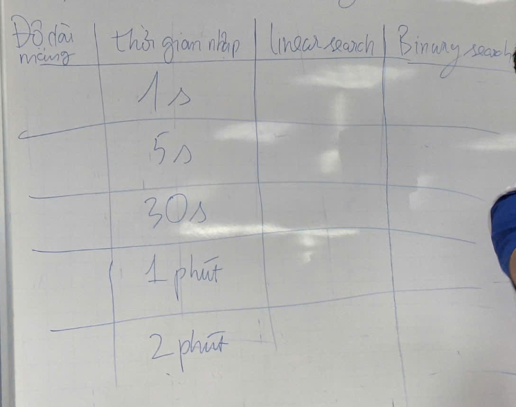
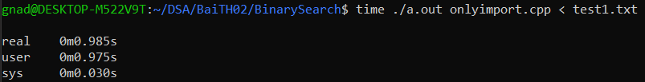
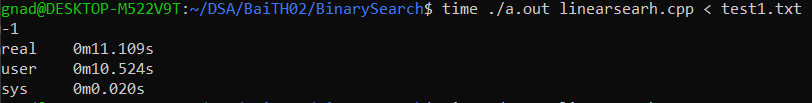
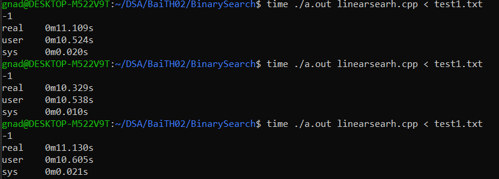
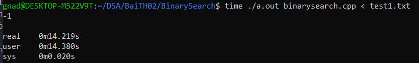
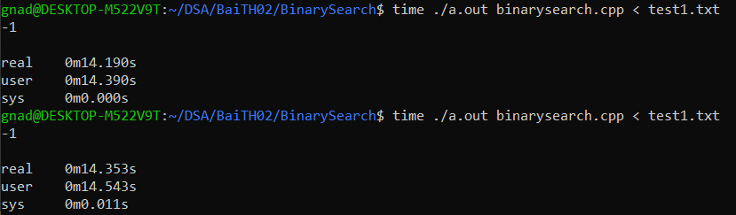
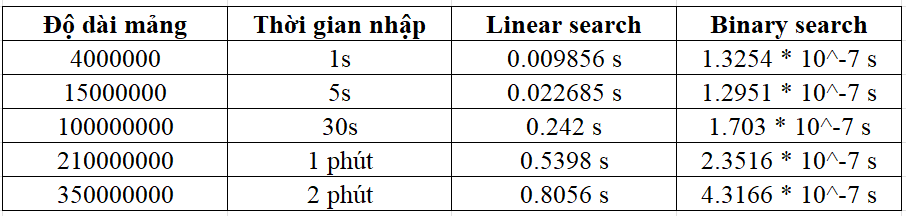

***QUÁ TRÌNH LÀM BÀI***
===

### Bài toán mở đầu:
    Cho một dãy số nguyên A có n phần tử (a[0], a[1], a[2], …, a[n-1]) đã có thứ tự (tăng dần) và một số nguyên K. Yêu cầu: Trả về vị trí của số K trong dãy A, nếu không có số K trong dãy thì in ra -1.

### Ta sẽ cần các chương trình sau để đo đạc thời gian: <br>

- Một chương trình về thuật toán tìm kiếm tuyến tính (Linear search) (từ giờ sẽ gọi tắt là ***TKTT***) <br>
- Một chương trình về thuật toán tìm kiếm nhị phân (Binary search) (từ giớ sẽ gọi tắt là ***TKNP***) <br>
- Một chương trình chỉ nhập dữ liệu để đó thời gian nhập<br>
- Một (hoặc nhiều) chương trình sinh các bộ test (ở đây sử dụng ngôn ngữ **python**) thỏa mãn với thời gian nhập <br>

### Yêu cầu về bộ test và các chương trình 
**Đối với TH thời gian nhập là 1s và 5s:** <br>

Dãy số là ```n``` các số nguyên đã được sắp xếp, các số trong dãy có giá trị độc lập với nhau dao động từ ```-n``` đến ```n```. <br>
Đối với TKTT: ta lặp lại bước tìm kiếm ```1000``` lần. <br>
Đối với TKNP: ta lặp lại bước tìm kiếm ```10^8``` lần. <br>

**Đối với TH thời gian nhập là 30s, 1 phút và 2 phút:** <br>
Dãy số là n các số nguyên có giá trị từ ```0``` đến ```n-1```.<br>
Đối với TKTT: ta lặp lại bước tìm kiếm ```200``` lần.<br>
Đối với TKNP: ta lặp lại bước tìm kiếm ```10^8``` lần. <br>
*---> Mục đích của việc thay đổi:* thuận tiện hơn cho mặt đo đạc và không cần tốn quá nhiều thời gian. <br>
**Các bộ test sẽ thỏa mãn kết quả chương trình trả về là không tìm kiếm được tức ```-1``` hoặc vị trí của số k trong mảng sẽ rất gần với 2 phần tử ở đầu dãy.**



### Từ cột thời gian nhập ta sẽ đi sinh bộ test<br>
Ta sẽ bắt đầu với đòng đầu tiên trong bảng (TH thời gian nhập là 1s): <br>
Từ chương trình sinh test cùng với chương trình đo thời gian nhập dữ liệu vào, ta có thể ước lượng ra được độ dài mảng hay số lượng phần tử phần của mảng là khoảng ```4000000``` phần tử.<br>


Sử dụng bộ test này cho chương trình TKTT,  ta được các thời gian chạy chương trình như sau:



Dòng ```real``` hiển thị thời gian chương trình chạy là tổng thời gian chương trình nhập vào bộ test và thực thi chương trình (thực hiện tìm kiếm), nên ta sẽ lấy thời gian trừ đi ```1 s``` (tức thời gian nhập test) thì sẽ được thời gian thực hiện tìm kiếm là ```10.109 s```.<br>
Lặp lại bước này thêm 2 lần nữa, ta có 3 lần chạy như sau:



---> Thời gian tìm kiếm trung bình:
 ```
 (10.109 + 9.329 + 10.130) / 3 = 9.856 s
 ```
Tuy nhiên do ta lặp lại bước tìm kiếm 1000 lần nên ta phải chia thời gian trung bình đi cho 1000 (với TH thời gian nhập test là 30s, 1 phút và 5 phút, chia cho 200 do lặp 200 lần):<br>
```
9.856 / 1000 = 0,009856 s
```
Đây chính là thời gian chương trình TKTT chạy với dãy số có ```4000000``` phần tử<br>
Lặp lại các bước trên với chương trình TKNP, nhưng do lặp lại 10^8 lần nên ta chia cho 10^8 thay vì 1000:<br>




Ta có thời gian trung bình là: ```1.3254 * 10^-7 s```

Tiếp tục lặp lại các bước trên cho các TH còn lại, ta sẽ có bảng đo đạc thời gian trung bình chạy như sau:




