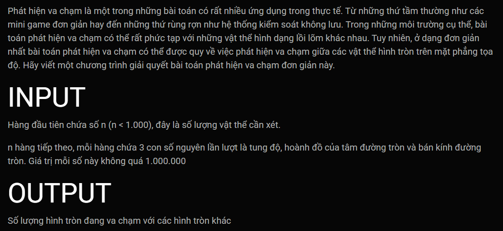

***Phát hiện va chạm***
===

INPUT:<BR>
```
4
408195 88811 72693
-158730 100875 183434
314824 -316000 7564
-27220 -21160 235500
```
OUTPUT:<BR> 
```
2
```
<BR>

INPUT:<BR>
```
6
28025 -60764 7854
-353312 277145 76352
267720 31043 299496
57905 233424 196695
-173112 -85600 37878
-363942 -285592 146290
```
OUTPUT:<BR> 
```
3
```